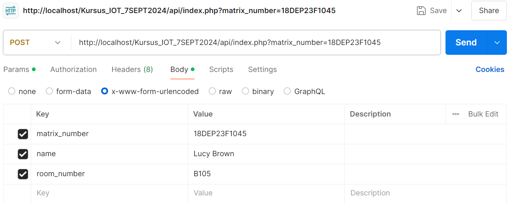

# IoT Project: Student Hostel Check-in/Check-out Monitoring
## Project Overview
Your role as a software engineer is to build an IoT project for monitoring student check-ins and check-outs at a hostel. The system will record the following information:

- **Name**
- **Matrix Number**
- **Room Number**
- **Date**
- **Timestamp**

**Hardware**: Key room's RFID card, ESP8266

**Database**: Using phpMyAdmin (testing by using XAMPP)
### Project Phases
The project will be divided into 3 phases:
1. Database Phase
2. API Phase
3. ESP8266 Phase

## Phase 1: Database Preparation
1. Open **phpMyAdmin** and create a database as follows:
**Database Creation**
The script checks if the `hostel_management` database exists and creates it if it doesn't.
```sql
-- Create the database if it doesn't exist
CREATE DATABASE IF NOT EXISTS hostel_management;

-- Use the created database
USE hostel_management;
```

**Table Creation**
- **student_checkin_checkout**: Stores check-in/check-out records with `id` as the primary key.
- **student_data**: Stores student information with `matrix_number` as the primary key.

```sql
-- Create a table to store student check-in/check-out records
CREATE TABLE IF NOT EXISTS student_checkin_checkout (
    id INT AUTO_INCREMENT PRIMARY KEY,
    matrix_number VARCHAR(20) NOT NULL,
    name VARCHAR(100) NOT NULL,
    room_number VARCHAR(10) NOT NULL,
    checkin_time DATETIME NOT NULL,
    checkout_time DATETIME
);

-- Optional: Insert some dummy data for testing purposes
INSERT INTO student_checkin_checkout (matrix_number, name, room_number, checkin_time)
VALUES ('18DTK23F1001', 'John Doe', 'A101', NOW());

-- Create the student_data table if it doesn't exist
CREATE TABLE IF NOT EXISTS student_data (
    matrix_number VARCHAR(20) PRIMARY KEY,
    name VARCHAR(100) NOT NULL,
    room_number VARCHAR(10) NOT NULL
);

-- Sample insert for testing
INSERT INTO student_data (matrix_number, name, room_number)
VALUES 
('18DTK23F1001', 'John Doe', 'A101'),
('18DEP23F1045', 'Lucy Brown', 'B105'),
('18DEO22F1088', 'Emma Watson', 'B106');
```
## Phase 2: PHP Script for API
Create a PHP script in the `htdocs` directory with the following logic:
**GET Method**
1. Check for `matrix_number`:
   - The script checks if a `matrix_number` is provided in the query string `($_GET['matrix_number'])`.
   - If provided, it retrieves the specific student record from the `student_data` table.
2. Retrieve Specific Record:
   - If a matching record is found, the data is returned as a JSON response.
   - If no matching record is found, an error message is returned.
3. Error Message:
   - If `matrix_number` is not provided, the script returns an error message: `"Matrix number not provided."`

**POST Method**
1. Check for Existing Record:
   - The script first checks if a record with the given `matrix_number` exists.
2. Check-in/Check-out Logic:
   - **Check-in Time**: If `checkin_time` is empty, it updates the `checkin_time` with the current timestamp.
   - **Check-out Time**: If `checkin_time` is set and `checkout_time` is null, it updates the `checkout_time` with the current timestamp.
3. Insert New Record:
- If the record does not exist, a new record is inserted with the provided `name`, `matrix_number`, `room_number`, and `checkin_time`.
4. Unsupported Method:
  - If a method other than GET or POST is used, an error message is returned indicating that the method is unsupported.

```php
<?php

header("Content-Type: application/json");

// Set the default timezone to Kuala Lumpur, Malaysia
date_default_timezone_set('Asia/Kuala_Lumpur');

// Database connection parameters
$servername = "localhost";
$username = "root";
$password = "";
$dbname = "hostel_management";

// Create connection to the hostel_management database
$conn = new mysqli($servername, $username, $password, $dbname);

// Check connection
if ($conn->connect_error) {
    die(json_encode(array("status" => "error", "message" => "Connection failed: " . $conn->connect_error)));
}

// Get the HTTP method (GET or POST)
$method = $_SERVER['REQUEST_METHOD'];

switch ($method) {
    case 'GET':
        if (isset($_GET['matrix_number'])) {
            $matrix_number = $conn->real_escape_string($_GET['matrix_number']);

            // Query to get a specific student record from student_data
            $sql = "SELECT * FROM student_data WHERE matrix_number = '$matrix_number'";
            $result = $conn->query($sql);

            if ($result->num_rows > 0) {
                $student_data = $result->fetch_assoc();
                echo json_encode($student_data);
            } else {
                echo json_encode(array("status" => "error", "message" => "Record not found for the provided matrix number"));
            }
        } else {
            // Return an error message if matrix_number is not provided
            echo json_encode(array("status" => "error", "message" => "Matrix number not provided"));
        }
        break;

    case 'POST':
        if (isset($_POST['matrix_number'])) {
            $matrix_number = $conn->real_escape_string($_POST['matrix_number']);

            // Check if the record for this matrix number exists
            $sql = "SELECT * FROM student_checkin_checkout WHERE matrix_number = '$matrix_number' ORDER BY checkin_time DESC LIMIT 1";
            $result = $conn->query($sql);
            
            if ($result->num_rows > 0) {
                $row = $result->fetch_assoc();
                
                if (!empty($row['checkin_time']) && !is_null($row['checkout_time'])) {
                    // Insert a new record if both check-in and check-out are recorded
                    if (isset($_POST['name']) && isset($_POST['room_number'])) {
                        $name = $conn->real_escape_string($_POST['name']);
                        $room_number = $conn->real_escape_string($_POST['room_number']);
                        $checkin_time = date('Y-m-d H:i:s'); // Set new check-in time
                        
                        $insert_sql = "INSERT INTO student_checkin_checkout (name, matrix_number, room_number, checkin_time)
                                       VALUES ('$name', '$matrix_number', '$room_number', '$checkin_time')";

                        if ($conn->query($insert_sql) === TRUE) {
                            echo json_encode(array("status" => "success", "message" => "New record created and check-in time set"));
                        } else {
                            echo json_encode(array("status" => "error", "message" => "Error: " . $conn->error));
                        }
                    } else {
                        echo json_encode(array("status" => "error", "message" => "Name or room number not provided"));
                    }
                        
                } elseif (is_null($row['checkout_time'])) {
                    // Update check-out time if check-in exists but check-out is empty
                    $checkout_time = date('Y-m-d H:i:s');
                    $update_sql = "UPDATE student_checkin_checkout 
                                   SET checkout_time = '$checkout_time'
                                   WHERE matrix_number = '$matrix_number' AND checkin_time = '{$row['checkin_time']}'";
                    if ($conn->query($update_sql) === TRUE) {
                        echo json_encode(array("status" => "success", "message" => "Check-out time updated successfully"));
                    } else {
                        echo json_encode(array("status" => "error", "message" => "Error: " . $conn->error));
                    }
                } else {
                    echo json_encode(array("status" => "error", "message" => "Unexpected condition met"));
                }
            } else {
                // Insert new record if none exists
                if (isset($_POST['name']) && isset($_POST['room_number'])) {
                    $name = $conn->real_escape_string($_POST['name']);
                    $room_number = $conn->real_escape_string($_POST['room_number']);
                    $checkin_time = date('Y-m-d H:i:s'); // Set check-in time
                    
                    $insert_sql = "INSERT INTO student_checkin_checkout (name, matrix_number, room_number, checkin_time)
                                   VALUES ('$name', '$matrix_number', '$room_number', '$checkin_time')";

                    if ($conn->query($insert_sql) === TRUE) {
                        echo json_encode(array("status" => "success", "message" => "New record created and check-in time set"));
                    } else {
                        echo json_encode(array("status" => "error", "message" => "Error: " . $conn->error));
                    }
                } else {
                    echo json_encode(array("status" => "error", "message" => "Name or room number not provided"));
                }                    
            }               
        } else {
            echo json_encode(array("status" => "error", "message" => "Matrix number not provided"));
        }
        break;
    default:
        echo json_encode(array("status" => "error", "message" => "Unsupported HTTP method"));
        break;
}
// Close the database connection
$conn->close();
?>
```
## Phase 3: Arduino Code for ESP8266
Write an Arduino code for the ESP8266 that reads the RFID card's unique ID and sends it to the database through the provided API.

**Required Libraries**
- MFRC522: For interfacing with the RFID module.
- WiFi: To connect to the WiFi network.
- HTTPClient: To make HTTP requests to the API.
- ArduinoJson: To handle JSON parsing

You can install these libraries via the Arduino Library Manager.
**Arduino Code**
```cpp
#include <ESP8266WiFi.h>
#include <ESP8266HTTPClient.h>
#include <MFRC522.h>
#include <SPI.h>
#include <ArduinoJson.h>

// Replace these with your network credentials
const char* ssid = "your_SSID";
const char* password = "your_PASSWORD";

// Replace this with the URL of your PHP script
const char* serverName = "http://your_ip/Kursus_IOT_7SEPT2024/api/index.php";

// Initialize RFID
#define RST_PIN D3
#define SS_PIN D4
MFRC522 mfrc522(SS_PIN, RST_PIN);

// Initialize WiFi
void setup() {
  Serial.begin(115200);
  connectToWiFi();
  
  // Initialize RFID
  SPI.begin();
  mfrc522.PCD_Init();

  Serial.println("Place your RFID card on the reader");
}

void loop() {
  // Look for new RFID card
  if (!mfrc522.PICC_IsNewCardPresent()) {
    return;
  }

  if (!mfrc522.PICC_ReadCardSerial()) {
    return;
  }

  // Read RFID UID
  String matrix_number = "";
  for (byte i = 0; i < mfrc522.uid.size; i++) {
    matrix_number += String(mfrc522.uid.uidByte[i] < 0x10 ? "0" : "");
    matrix_number += String(mfrc522.uid.uidByte[i], HEX);
  }
  matrix_number.toUpperCase();

  Serial.print("Matrix Number: ");
  Serial.println(matrix_number);

  // Get student data
  getStudentData(matrix_number);

  // Record check-in/check-out
  recordCheckInCheckOut(matrix_number);

  // Halt PICC
  mfrc522.PICC_HaltA();
  mfrc522.PCD_StopCrypto1();
}

void connectToWiFi() {
  WiFi.begin(ssid, password);
  Serial.print("Connecting to ");
  Serial.print(ssid);

  while (WiFi.status() != WL_CONNECTED) {
    delay(500);
    Serial.print(".");
  }

  Serial.println("\nConnected!");
  Serial.print("IP Address: ");
  Serial.println(WiFi.localIP());
}

void getStudentData(const String& matrixNumber) {
  if (WiFi.status() == WL_CONNECTED) {
    HTTPClient http;
    String url = String(serverName) + "?matrix_number=" + matrixNumber;

    http.begin(url);
    int httpResponseCode = http.GET();

    if (httpResponseCode > 0) {
      String payload = http.getString();
      Serial.println("GET Response Code: " + String(httpResponseCode));
      Serial.println("Payload: " + payload);
      
      // Parse JSON payload
      DynamicJsonDocument doc(1024);
      DeserializationError error = deserializeJson(doc, payload);
      
      if (!error) {
        String matrix_number = doc["matrix_number"].as<String>();
        String name = doc["name"].as<String>();
        String room_number = doc["room_number"].as<String>();
        
        Serial.println("Student Name: " + name);
        Serial.println("Room Number: " + room_number);
      } else {
        Serial.println("Failed to parse JSON");
      }
    } else {
      Serial.println("Error on GET request");
    }

    http.end();
  } else {
    Serial.println("Error in WiFi connection");
  }
}

void recordCheckInCheckOut(const String& matrixNumber, const String& name, const String& roomNumber) {
  if (WiFi.status() == WL_CONNECTED) {
    HTTPClient http;

    http.begin(serverName);
    http.addHeader("Content-Type", "application/x-www-form-urlencoded");

    String postData = "matrix_number=" + matrixNumber + "&name=" + name + "&room_number=" + roomNumber;
    int httpResponseCode = http.POST(postData);

    if (httpResponseCode > 0) {
      String payload = http.getString();
      Serial.println("POST Response Code: " + String(httpResponseCode));
      Serial.println("Payload: " + payload);
    } else {
      Serial.println("Error on POST request");
    }

    http.end();
  } else {
    Serial.println("Error in WiFi connection");
  }
}

```
You can copy and paste this code into your respective project files and start implementing your project.
## Testing:
1. **Clone the Repository**
   Navigate to the htdocs directory in your XAMPP installation and execute the following command to clone the project repository:
```bash
git clone https://github.com/kingdiaw/Kursus_IOT_7SEPT2024.git
```
2. **Start the XAMPP Server**
Ensure that the Apache server in XAMPP is running.

3. **Access the API**
   Open your web browser and enter the following URL to test the API:
```plaintext
http://localhost/Kursus_IOT_7SEPT2024/api/index.php?matrix_number=18DTK23F1001
```
4. **Expected Output**
The browser should display the following JSON output:
```json
{"matrix_number":"18DTK23F1001","name":"John Doe","room_number":"A101"}
```
## Testing POST Method
Steps to Install and Use Postman for Sending a POST Request

1. **Install Postman for Windows**
- Download the installer from [this link](https://dl.pstmn.io/download/latest/win64).
- Run the installer and follow the on-screen instructions to complete the installation.

2. **Open Postman and Create a New Request**
- Launch Postman after installation.
- Click on **New** and select **Request**.

3. **Set the Request Type to POST**
- In the new request window, find the dropdown menu next to the request URL field.
- Select **POST** from the dropdown options.

4. **Enter the Request URL**
- In the URL field, enter the following URL:`http://localhost/Kursus_IOT_7SEPT2024/api/index.php?matrix_number=18DEP23F1045`

5. **Go to the Body Tab and Select x-www-form-urlencoded**
- Click on the **Body** tab below the URL field.
- Select the **x-www-form-urlencoded** option.
<p align="center">
  
</p>

6. **Enter Your Data**
- In the key-value fields that appear, enter your data.

7. **Click Send to Make the Request**
- Once all the data is entered, click the **Send** button.
- Postman will send the request to the specified URL, and you can view the response in the lower panel.
